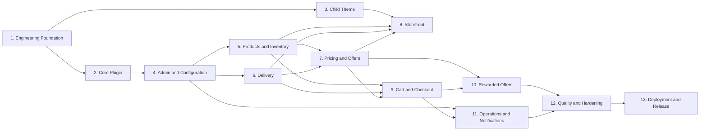

# GalaxyOne V1 — Implementation Roadmap

This roadmap is ordered from lowest to highest implementation complexity. Each phase produces a working, verifiable increment and preserves the architecture boundary:

- WooCommerce owns products, cart, checkout, and orders.
- GalaxyOne Core owns business rules.
- The child theme owns presentation.
- Elementor is used for layout and editable content only.

## Phase 1 — Engineering Foundation

**Objective:** Establish a reliable repository, local development workflow, quality checks, and project conventions.

**Deliverables:**

- Repository conventions and environment documentation.
- PHP dependency management and coding-standard configuration.
- Automated quality checks for every change.
- Initial WordPress, WooCommerce, Elementor Pro, plugin, and child-theme installation checklist.

**Files and folders to create or modify:**

- `README.md`
- `.gitignore`
- `.editorconfig`
- `composer.json`
- `phpcs.xml.dist`
- `phpunit.xml.dist`
- `tests/bootstrap.php`
- `.github/workflows/quality.yml`
- `docs/DEVELOPMENT_GUIDE.md`
- `docs/IMPLEMENTATION_PLAN.md`

**Dependencies:** None.

**Acceptance criteria:**

- The project can be set up consistently by another developer.
- Static coding-standard and test commands complete with exit code `0`.
- CI runs the same checks for each pull request.

**Verification checklist:**

- Set up a clean local environment using the development guide.
- Run the configured coding-standard command.
- Run the configured test command.
- Open a test pull request and confirm the quality workflow reports success.

**Estimated effort:** 1–2 developer days.  
**Complexity:** Low.

**Risks:**

- Local environment versions may drift from production hosting.
- Incomplete exclusions may expose secrets or large upload files.

---

## Phase 2 — GalaxyOne Core Plugin Foundation

**Objective:** Create a modular, safely activatable plugin foundation with no feature-specific business logic.

**Deliverables:**

- PSR-4 autoloading and namespace structure.
- Plugin bootstrap and module-registration mechanism.
- WooCommerce dependency validation.
- Activation, deactivation, uninstall, migration, and version-management framework.
- Shared validation, capability, logging, and error-handling services.

**Files and folders to create or modify:**

- `wp-content/plugins/galaxyone-core/galaxyone-core.php`
- `wp-content/plugins/galaxyone-core/composer.json`
- `wp-content/plugins/galaxyone-core/app/Plugin.php`
- `wp-content/plugins/galaxyone-core/app/Contracts/`
- `wp-content/plugins/galaxyone-core/app/Support/`
- `wp-content/plugins/galaxyone-core/app/Database/`
- `wp-content/plugins/galaxyone-core/app/Security/`
- `wp-content/plugins/galaxyone-core/app/ActivityLog/`
- `wp-content/plugins/galaxyone-core/assets/`
- `wp-content/plugins/galaxyone-core/templates/`
- `wp-content/plugins/galaxyone-core/uninstall.php`
- `wp-content/plugins/galaxyone-core/readme.txt`

**Dependencies:** Phase 1; WordPress and WooCommerce available.

**Acceptance criteria:**

- Plugin activates only when required dependencies are present.
- Plugin can register modules without direct coupling between them.
- Plugin version and database schema version are tracked.
- Deactivation does not destroy business data.

**Verification checklist:**

- Activate, deactivate, and reactivate the plugin.
- Attempt activation with WooCommerce unavailable.
- Run the same migration twice and confirm no duplicate schema or data.
- Confirm WordPress debug logging contains no notices or warnings.

**Estimated effort:** 2–3 developer days.  
**Complexity:** Low.

**Risks:**

- Poor bootstrap structure would make all later modules harder to maintain.
- Migration mistakes can create upgrade risk later.

---

## Phase 3 — Child Theme and Design Foundation

**Objective:** Establish the mobile-first presentation layer and reusable design tokens.

**Deliverables:**

- Child theme foundation.
- Responsive styling tokens and reusable components.
- WooCommerce visual baseline.
- Documented component, typography, spacing, and accessibility rules.

**Files and folders to create or modify:**

- `wp-content/themes/galaxyone-child/style.css`
- `wp-content/themes/galaxyone-child/functions.php`
- `wp-content/themes/galaxyone-child/assets/css/tokens.css`
- `wp-content/themes/galaxyone-child/assets/css/components.css`
- `wp-content/themes/galaxyone-child/assets/css/woocommerce.css`
- `wp-content/themes/galaxyone-child/assets/js/frontend.js`
- `wp-content/themes/galaxyone-child/woocommerce/`
- `docs/DESIGN_SYSTEM.md`

**Dependencies:** Phase 1; parent theme and Elementor Pro.

**Acceptance criteria:**

- Theme can be activated without affecting plugin behavior.
- Core controls render at 320 px, 768 px, and 1280 px viewport widths without horizontal overflow.
- Interactive controls have visible keyboard focus and touch targets of at least 44 × 44 CSS pixels.
- Theme files contain no pricing, delivery, campaign, or reward decisions.

**Verification checklist:**

- Activate the theme on a staging site.
- Inspect pages at 320 px, 768 px, and 1280 px.
- Navigate representative controls with keyboard only.
- Search theme files to confirm no GalaxyOne business service or direct pricing calculation is present.

**Estimated effort:** 2–3 developer days.  
**Complexity:** Low.

**Risks:**

- Elementor styling may conflict with child-theme styles.
- Too many template overrides raise WooCommerce update costs.

---

## Phase 4 — Admin, Security, and Configuration Framework

**Objective:** Build the secure administrative foundation that all business modules use.

**Deliverables:**

- GalaxyOne admin menu and settings screens.
- Role/capability enforcement.
- Nonce, validation, sanitization, and escaping utilities.
- Activity-log framework.
- Shared configuration repository and form components.

**Files and folders to create or modify:**

- `app/Admin/AdminModule.php`
- `app/Admin/MenuRegistrar.php`
- `app/Admin/SettingsPage.php`
- `app/Settings/SettingsModule.php`
- `app/Settings/SettingsRepository.php`
- `app/Security/Capabilities.php`
- `app/Security/NonceVerifier.php`
- `app/Security/InputValidator.php`
- `app/ActivityLog/ActivityLogModule.php`
- `app/ActivityLog/ActivityLogRepository.php`
- `app/Database/Migrations/CreateActivityLogTable.php`
- `templates/admin/`
- `assets/css/admin/`
- `assets/js/admin/`

**Dependencies:** Phases 1–2.

**Acceptance criteria:**

- An authorized administrator can save a valid GalaxyOne setting.
- A user without the required capability receives an authorization failure before any setting is changed.
- Invalid or missing nonce requests make no data change.
- A successful change creates one auditable activity record.

**Verification checklist:**

- Test valid and invalid settings submissions.
- Test administrator, shop-manager, and unauthorized-user access.
- Submit expired and missing nonces.
- Verify activity-log data after an approved update.

**Estimated effort:** 3–4 developer days.  
**Complexity:** Medium.

**Risks:**

- Weak capability control could expose high-impact operations.
- An over-general settings framework may become difficult to use.

---

## Phase 5 — Product, Inventory, and Daily Price Extensions

**Objective:** Add GalaxyOne rules for Water and Blooms while preserving WooCommerce as the product owner.

**Deliverables:**

- Water and Blooms product extensions.
- Daily flower-price and availability management.
- Water availability and inventory controls.
- Product-level business metadata and administrator workflow.
- Product availability validation service.

**Files and folders to create or modify:**

- `app/Products/ProductsModule.php`
- `app/Products/ProductCategoryResolver.php`
- `app/Products/ProductAvailabilityService.php`
- `app/Inventory/InventoryModule.php`
- `app/Inventory/InventoryService.php`
- `app/Pricing/DailyFlowerPriceRepository.php`
- `app/Pricing/WaterPriceService.php`
- `app/Database/Migrations/CreateFlowerDailyPricesTable.php`
- `templates/admin/products/`
- `templates/admin/flower-prices/`
- `templates/frontend/product/`

**Dependencies:** Phases 2 and 4.

**Acceptance criteria:**

- An authorized administrator can save a daily price and availability value for a Bloom product.
- An unavailable Water product remains visible and cannot be added to the cart.
- A saved daily flower price is available to the pricing service for its effective date.
- Product availability is enforced by server-side validation.

**Verification checklist:**

- Create one Water and one Bloom product.
- Save and retrieve a daily flower price.
- Mark Water unavailable and attempt a cart addition.
- Change flower availability and confirm a later cart validation rejects it.
- Review the corresponding audit-log entries.

**Estimated effort:** 4–5 developer days.  
**Complexity:** Medium.

**Risks:**

- Price changes during shopping require later cart revalidation.
- Incorrect inventory updates can lead to overselling.

---

## Phase 6 — Delivery Engine

**Objective:** Implement serviceability, delivery charge, date, slot, capacity, and reservation rules.

**Deliverables:**

- Configurable service areas.
- Delivery windows, cutoff rules, capacity limits, and closed dates.
- Delivery-fee calculation.
- Capacity reservation and release handling.
- Server-side delivery validation.
- Order-level delivery metadata.

**Files and folders to create or modify:**

- `app/Delivery/DeliveryModule.php`
- `app/Delivery/ServiceAreaService.php`
- `app/Delivery/DeliverySlotService.php`
- `app/Delivery/DeliveryCapacityService.php`
- `app/Delivery/DeliveryReservationService.php`
- `app/Delivery/DeliveryFeeCalculator.php`
- `app/Delivery/DeliveryValidationService.php`
- `app/Database/Migrations/CreateDeliveryRulesTable.php`
- `app/Database/Migrations/CreateDeliveryCapacityTable.php`
- `app/Database/Migrations/CreateDeliveryReservationsTable.php`
- `templates/admin/delivery/`
- `templates/frontend/delivery/`

**Dependencies:** Phase 4. This phase may proceed in parallel with Phase 5.

**Acceptance criteria:**

- An administrator can configure a service area, delivery slot, fee, and capacity.
- A supplied out-of-area address is rejected by the delivery validator.
- A selected slot at capacity is rejected by the delivery validator.
- A valid delivery selection creates one capacity reservation; expired or cancelled reservations release capacity exactly once.

**Verification checklist:**

- Configure one eligible and one ineligible service area.
- Validate both addresses through the delivery service.
- Fill a slot to capacity and validate one additional request.
- Create a valid reservation, release it, and confirm the available capacity returns to its prior value.
- Attempt two concurrent reservations for the final available capacity and confirm that only one succeeds.
- Confirm all configuration changes are audited.

**Estimated effort:** 5–6 developer days.  
**Complexity:** Medium.

**Risks:**

- Capacity updates can have race conditions.
- Delivery promises can become inaccurate if cart or address changes are not recalculated.

---

## Phase 7 — Pricing and Offers Engine

**Objective:** Centralize all price decisions and campaign behavior.

**Deliverables:**

- One authoritative pricing resolver.
- Scheduled offer management.
- Product and delivery offer eligibility.
- Campaign lifecycle management.
- Price-priority enforcement.

**Files and folders to create or modify:**

- `app/Pricing/PricingModule.php`
- `app/Pricing/PriceResolver.php`
- `app/Pricing/PriceSnapshotService.php`
- `app/Offers/OffersModule.php`
- `app/Offers/CampaignService.php`
- `app/Offers/OfferEligibilityService.php`
- `app/Offers/FreeDeliveryOfferService.php`
- `app/Database/Migrations/CreateOfferCampaignsTable.php`
- `templates/admin/offers/`
- `templates/admin/campaigns/`

**Dependencies:** Phases 5 and 6.

**Acceptance criteria:**

- The priority order is enforced: rewarded offer, scheduled offer, normal price.
- Expired, paused, and future campaigns cannot apply.
- Cart, checkout, and order creation use the same price resolver.
- Campaigns are configurable and auditable.

**Verification checklist:**

- Test each price priority independently.
- Test campaign start, expiry, pause, and deletion behavior.
- Test free-delivery offer eligibility.
- Verify stored order totals remain unchanged after later campaign edits.
- Verify browser-submitted prices cannot override server calculation.

**Estimated effort:** 4–5 developer days.  
**Complexity:** Medium.

**Risks:**

- Multiple offer types can create inconsistent totals without strict centralization.
- Cached prices can become stale around campaign boundaries.

---

## Phase 8 — Storefront and Product Experience

**Objective:** Build the customer-facing homepage, category navigation, product cards, and product information experience.

**Deliverables:**

- Homepage sections for Water, Blooms, and future-category placeholders.
- Product and category card rendering.
- Live availability, pricing, delivery, and offer presentation.
- Clear empty, unavailable, loading, and error states.
- Elementor templates using plugin-provided data.

**Files and folders to create or modify:**

- `app/Frontend/FrontendModule.php`
- `app/Frontend/ProductCardRenderer.php`
- `app/Frontend/CategoryRenderer.php`
- `templates/frontend/homepage/`
- `templates/frontend/product-card.php`
- `templates/frontend/category-card.php`
- `wp-content/themes/galaxyone-child/assets/css/storefront.css`
- Elementor templates and global styles

**Dependencies:** Phases 3, 5, 6, and 7.

**Acceptance criteria:**

- The homepage renders Water, Blooms, and future-category placeholders at 320 px and 1280 px without horizontal overflow.
- Each product card displays the current server-provided price, availability, and delivery information.
- An unavailable product has a visible unavailable state and no purchasable action.
- All product-navigation and add-to-cart controls are keyboard reachable.
- Reward messaging is clearly optional and does not alter normal purchase behavior.

**Verification checklist:**

- View homepage, category, and product displays at 320 px and 1280 px.
- Compare displayed product values with plugin service output.
- Test an unavailable product state.
- Navigate every product action by keyboard and touch.
- Confirm Elementor templates do not calculate prices or delivery rules.

**Estimated effort:** 4–5 developer days.  
**Complexity:** Medium.

**Risks:**

- Caching may show stale price or availability information.
- Presentation code can accidentally duplicate business rules.

---

## Phase 9 — Cart and Checkout Integration

**Objective:** Apply all GalaxyOne rules safely at cart and checkout.

**Deliverables:**

- Cart validation and recalculation.
- Delivery selection and final validation.
- Final price locking.
- Checkout field handling.
- COD and UPI-on-delivery support.
- Order metadata persistence.

**Files and folders to create or modify:**

- `app/Cart/CartModule.php`
- `app/Cart/CartValidationService.php`
- `app/Cart/CartRecalculationService.php`
- `app/Checkout/CheckoutModule.php`
- `app/Checkout/CheckoutValidationService.php`
- `app/Orders/OrderMetaService.php`
- `app/Orders/OrderStatusService.php`
- `templates/frontend/cart/`
- `templates/frontend/checkout/`

**Dependencies:** Phases 5, 6, and 7. Phase 8 is required for end-to-end customer testing, but is not a code dependency.

**Acceptance criteria:**

- Cart totals are recalculated from server-side product, offer, and delivery services.
- Checkout rejects unavailable products, invalid delivery, expired offers, and changed prices.
- A successful order stores final price, discount, delivery fee, slot, and delivery metadata.
- COD and UPI-on-delivery are presented only when enabled.

**Verification checklist:**

- Add, remove, and change quantities in the cart.
- Change a product price or availability before checkout and verify revalidation.
- Test eligible and ineligible delivery selections.
- Test expired offer rejection.
- Place a successful order and inspect its stored metadata.

**Estimated effort:** 6–8 developer days.  
**Complexity:** High.

**Risks:**

- WooCommerce checkout integration and calculation timing can cause mismatched totals.
- Checkout integration can vary across WooCommerce checkout implementations.

---

## Phase 10 — Rewarded Offer Engine

**Objective:** Deliver optional rewarded offers through a provider-neutral, secure reward system.

**Deliverables:**

- Advertisement-provider interface.
- Configurable reward campaigns.
- Reward eligibility, completion, redemption, expiry, and retry handling.
- Staging/test provider implementation.
- Checkout integration for unlocked rewards.

**Files and folders to create or modify:**

- `app/RewardedAds/RewardedAdsModule.php`
- `app/RewardedAds/Contracts/AdvertisementProviderInterface.php`
- `app/RewardedAds/RewardEligibilityService.php`
- `app/RewardedAds/RewardCompletionService.php`
- `app/RewardedAds/RewardRedemptionService.php`
- `app/RewardedAds/Providers/`
- `app/Database/Migrations/CreateRewardCampaignsTable.php`
- `app/Database/Migrations/CreateRewardEventsTable.php`
- `templates/admin/rewarded-ads/`
- `templates/frontend/rewarded-offers/`
- `assets/js/rewarded-ads.js`

**Dependencies:** Phases 7 and 9.

**Acceptance criteria:**

- A normal-price purchase works without any reward interaction.
- Only a verified reward completion can produce an unlocked reward state.
- Failed, closed, expired, or paused campaigns cannot change checkout pricing.
- Reward redemption is recorded once and is auditable.

**Verification checklist:**

- Complete a normal-price purchase.
- Simulate successful provider completion and verify the eligible price.
- Simulate provider failure, early close, retry, and campaign expiry.
- Submit a forged reward state and confirm rejection.
- Verify reward event and activity-log records.

**Estimated effort:** 6–8 developer days.  
**Complexity:** High.

**Risks:**

- Third-party ad-provider restrictions may affect production integration.
- Reward fraud and provider callback validation are security-critical.

---

## Phase 11 — Operational Dashboard, Order Management, and Notifications

**Objective:** Provide administrators with the tools to operate GalaxyOne daily.

**Deliverables:**

- Operational dashboard.
- Order search, filtering, status transitions, and management actions.
- Customer order-history views.
- Campaign and delivery operational visibility.
- Order confirmation and status notifications.
- Notification delivery logs, initial reports, and activity-log views.

**Files and folders to create or modify:**

- `app/Orders/OrdersModule.php`
- `app/Orders/AdminOrderActions.php`
- `app/Admin/DashboardModule.php`
- `app/Admin/ReportsModule.php`
- `app/Customers/CustomerModule.php`
- `app/Notifications/NotificationsModule.php`
- `app/Notifications/NotificationLogRepository.php`
- `app/Notifications/Contracts/NotificationProviderInterface.php`
- `app/Notifications/Providers/`
- `app/Database/Migrations/CreateNotificationLogTable.php`
- `templates/admin/dashboard/`
- `templates/admin/orders/`
- `templates/admin/customers/`
- `templates/admin/reports/`
- `templates/admin/activity-log/`

**Dependencies:** Phases 4 and 9. This phase may proceed in parallel with Phase 10.

**Acceptance criteria:**

- Authorized staff can find and manage orders securely.
- Order status changes follow valid transitions.
- Dashboard figures reconcile with stored orders.
- Triggering an order-confirmation or order-status event creates one notification-delivery log entry with a status of queued, sent, failed, or skipped.
- No customer data is visible to unauthorized roles.

**Verification checklist:**

- Test status changes for each allowed order state.
- Test order filtering, searching, and customer history.
- Reconcile dashboard counts and revenue totals against orders.
- Trigger a notification and inspect its delivery-log status.
- Test access with administrator, shop-manager, and unauthorized accounts.

**Estimated effort:** 5–7 developer days.  
**Complexity:** High.

**Risks:**

- Dashboard queries may become slow without efficient data access.
- Notification-provider failures need logging and retry handling.

---

## Phase 12 — Automated Testing, Security, and Performance Hardening

**Objective:** Make the completed system production-ready through systematic validation.

**Deliverables:**

- Automated unit, integration, and end-to-end tests.
- Security test checklist and remediation workflow.
- Performance test results and optimizations.
- Mobile and accessibility verification.
- Upgrade, backup, restore, and regression test procedures.

**Files and folders to create or modify:**

- `tests/Unit/`
- `tests/Integration/`
- `tests/E2E/`
- `tests/Fixtures/`
- `tests/Support/`
- `tests/E2E/playwright.config.ts`
- `.github/workflows/quality.yml`
- `docs/TEST_PLAN.md`
- `docs/SECURITY_OPERATIONS.md`
- `docs/RELEASE_CHECKLIST.md`

**Dependencies:** Phases 9, 10, and 11.

**Acceptance criteria:**

- The automated unit, integration, and end-to-end suites complete with exit code `0`.
- Normal-price and rewarded-offer purchase flows pass on staging at 320 px and 1280 px viewport widths.
- Dependency and security scans report no unresolved critical or high-severity findings.
- Home, product, cart, and checkout pages complete the approved keyboard-navigation and mobile viewport checks.
- A backup restoration to a non-production environment completes and passes smoke tests.

**Verification checklist:**

- Run unit, integration, and end-to-end suites in CI.
- Execute normal-price and rewarded-offer purchase scenarios on staging.
- Run dependency and security scans.
- Test supported mobile viewport sizes and keyboard navigation.
- Measure key-page load performance on a throttled mobile profile.
- Restore a backup into a non-production environment and run smoke tests.

**Estimated effort:** 7–10 developer days.  
**Complexity:** High.

**Risks:**

- Third-party services may need separate staging environments.
- Real-device testing may expose timing and network issues absent locally.

---

## Phase 13 — Deployment and Version 1 Release

**Objective:** Deploy GalaxyOne through a controlled, observable, recoverable release process.

**Deliverables:**

- Development, staging, and production deployment procedures.
- Production environment configuration.
- Backup, monitoring, logging, and rollback procedures.
- Launch checklist and operational handoff.

**Files and folders to create or modify:**

- `config/.env.example`
- `docs/DEPLOYMENT_GUIDE.md`
- `docs/OPERATIONS_RUNBOOK.md`
- `docs/ROLLBACK_PLAN.md`
- `.github/workflows/release.yml`
- Environment configuration templates
- Production WordPress, cache, cron, mail, SSL, and monitoring configuration

**Dependencies:** Phase 12; production hosting and approved external providers.

**Acceptance criteria:**

- A staging release succeeds before production deployment.
- Production secrets are never committed to source control.
- Backups, monitoring, email, scheduled tasks, and caching are functioning.
- Rollback is documented and rehearsed.
- Launch sign-off is complete.

**Verification checklist:**

- Deploy to staging and run smoke tests.
- Verify SSL, cron, transactional email, backups, and monitoring.
- Verify database migration process.
- Verify production-access restrictions.
- Rehearse rollback from a staging deployment.
- Complete final launch checklist.

**Estimated effort:** 3–5 developer days.  
**Complexity:** High.

**Risks:**

- Production hosting differences may affect cache, cron, email, or provider callbacks.
- Data migrations require careful release timing and rollback preparation.

# Dependency Graph

# Critical Path

1. Engineering Foundation
2. Core Plugin Foundation
3. Admin, Security, and Configuration Framework
4. Product, Inventory, and Daily Price Extensions
5. Delivery Engine
6. Pricing and Offers Engine
7. Cart and Checkout Integration
8. Rewarded Offer Engine
9. Automated Testing, Security, and Performance Hardening
10. Deployment and Version 1 Release

The Child Theme and Storefront phases are required before customer-facing release validation, but are not on the backend business-rule critical path. Operations, Orders, and Notifications may proceed in parallel with Rewarded Offers after Cart and Checkout Integration.

# Version 1 Milestones

## Milestone 1 — Platform Foundation

**Phases:** 1–4

**Outcome:** A secure, modular GalaxyOne plugin and child-theme foundation with administration, configuration, migrations, and engineering controls.

## Milestone 2 — Commerce Rules Ready

**Phases:** 5–7

**Outcome:** Water and Blooms product rules, daily pricing, inventory, delivery, campaign management, and authoritative pricing behavior are functional.

## Milestone 3 — Customer Purchase Flow Ready

**Phases:** 8–10

**Outcome:** Customers can browse products, manage a cart, select valid delivery, check out, and optionally unlock a valid rewarded offer.

## Milestone 4 — Operations Ready

**Phase:** 11

**Outcome:** Administrators can manage orders, customers, deliveries, campaigns, notifications, reports, and operational activity.

## Milestone 5 — Production Release Ready

**Phases:** 12–13

**Outcome:** GalaxyOne has passed functional, security, accessibility, mobile, performance, backup, release, and operational readiness checks.
